# LinkedIn-clone
A SPA using React JS &amp; DJango, where user can create account &amp; seek jobs as well as create jobs! 

## User SignUp

### 1. Email Signup
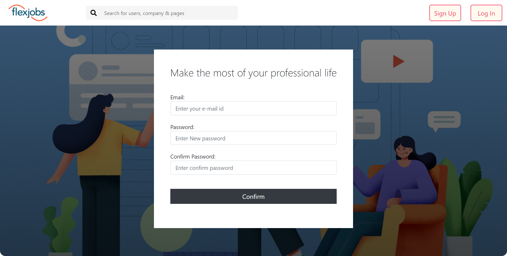

### 2. OTP verification
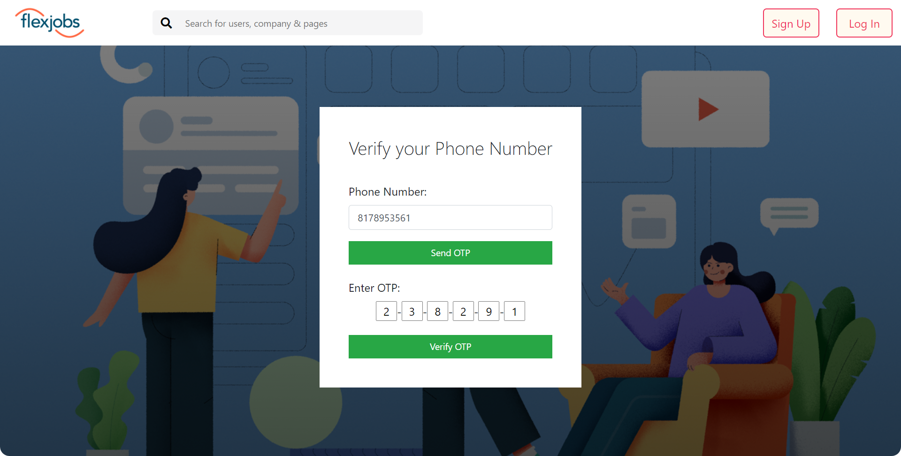

***

## Login Page
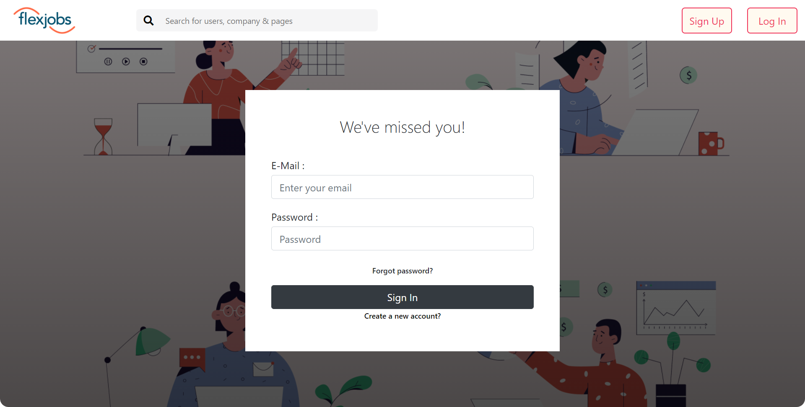

***

## Feed Page
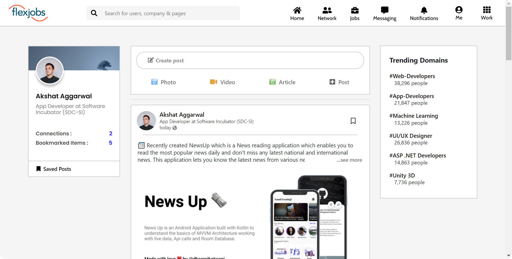

***

## Create new post
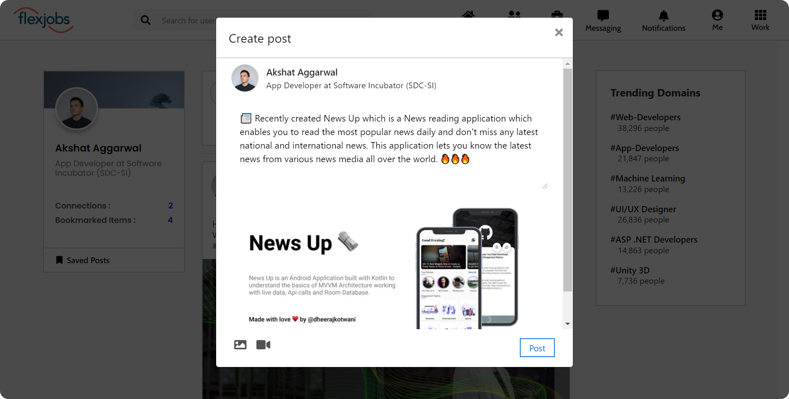

***

## Message your connections
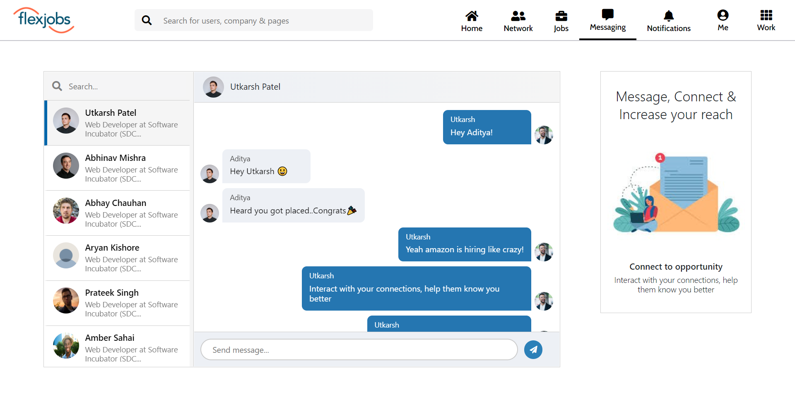

***

## Create a network
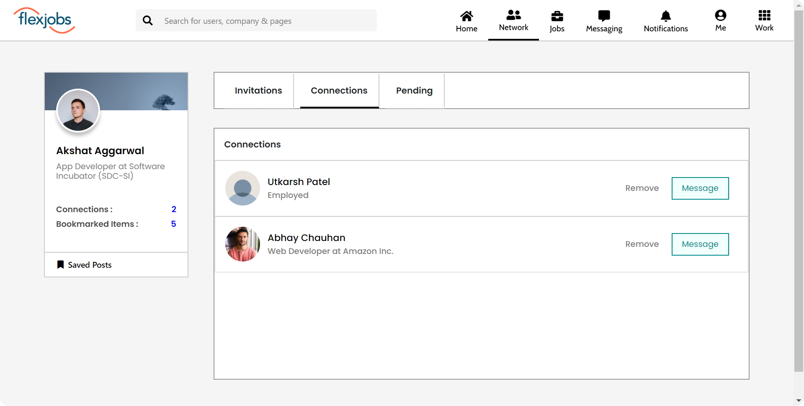

***

## User Profile
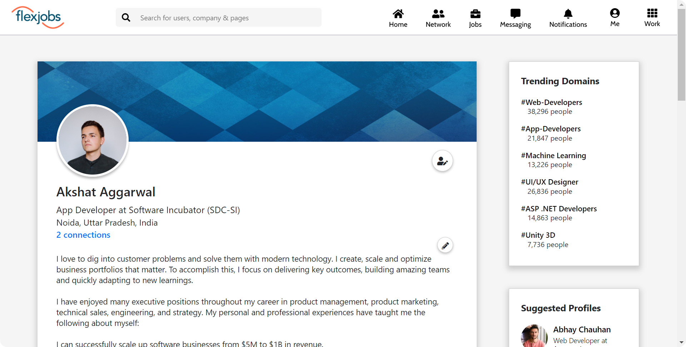

***

## Recieve notifications
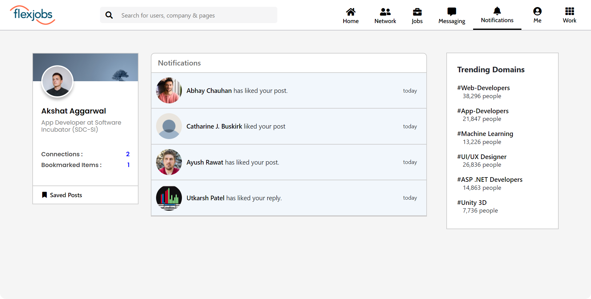

***

## View posted job vacancy
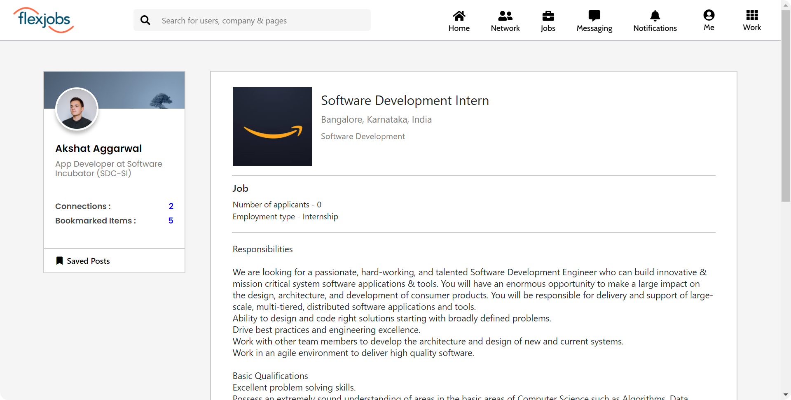

***

## Hire employees by posting jobs
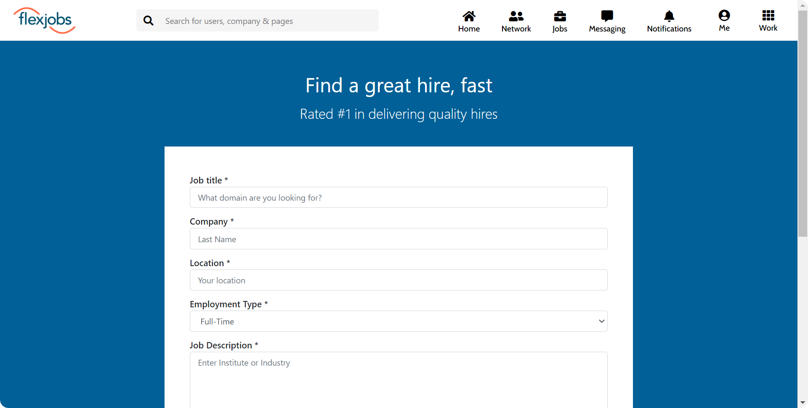

***

## Search for various users & available jobs
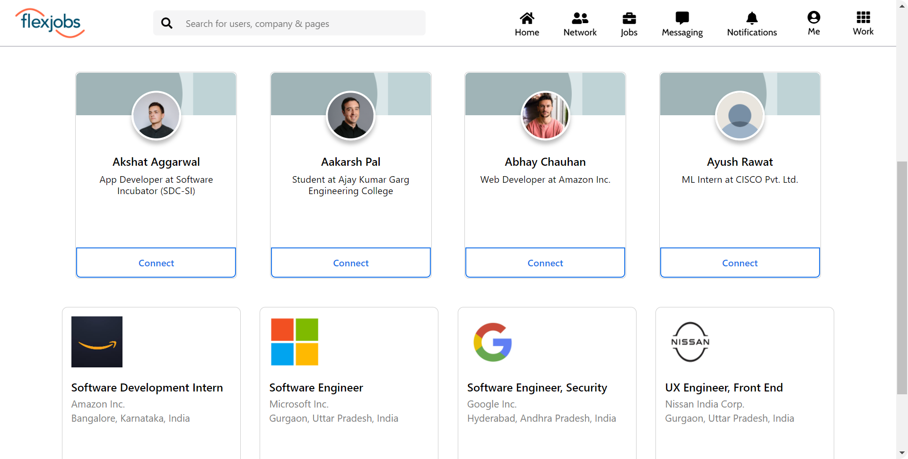

***

## Built with
* Frontend - [ReactJS](https://github.com/reactjs/reactjs.org)
* Backend - [Django](https://www.django-rest-framework.org/)

## Features
* Authentication with Email verification
* Connection with other users 
* Messaging feature between connections
* Creating job vacancies as an employer
* Applying to other such vacancies.
* Searching other users and jobs
* Creating posts 
* Bookmarking posts
* Commenting on such post and replying to comments
* Various reactions on posts
* And many more

> Here's the [link](https://github.com/AdityaPratap2001/LinkedIn-clone) for frontend repo  

